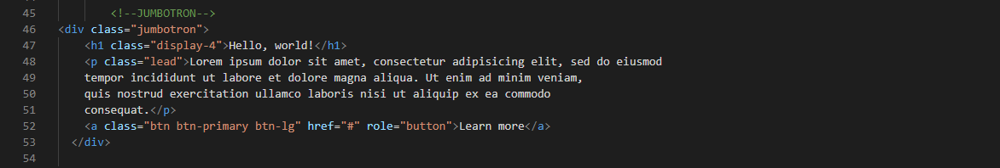

### Nama: Dimas Riyadh Alfajri
    Nim: 312010029
    Kelas: TI.20.A.1

## Praktikum 6: Web Framework

### Langkah-langkah 

### 1. Buat folder baru dengan nama lab6_css_framework atau Web6Lab, buat file baru dokumen html

### 2. Buatlah layout web sederhana menggunakan css frameword (Twitter Bootsrtap)

1. Quick start

Buka web https://getbootstrap.com Disini saya memakai Bootstrap 4. Copy atau download CSS & JS Bootstrap, Saya memilih untuk copy

2. Navbar

Buat komponen website yang berupa menu. yang biasanya diletakkan pada header website.

Untuk mencari component klik menu documentation pada web bootstrap

3. Jumbotron

Selanjutnya buat jumbotron atau area besar pada Bootstrap, umumnya digunakan untuk menampilkan sebuah infromasi penting.

